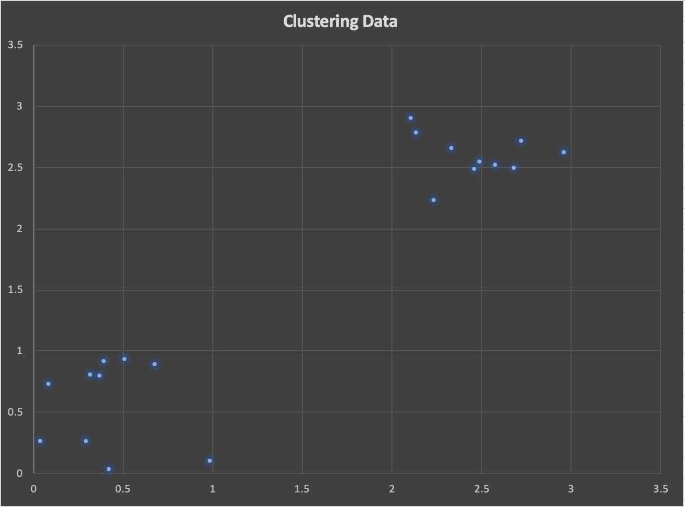
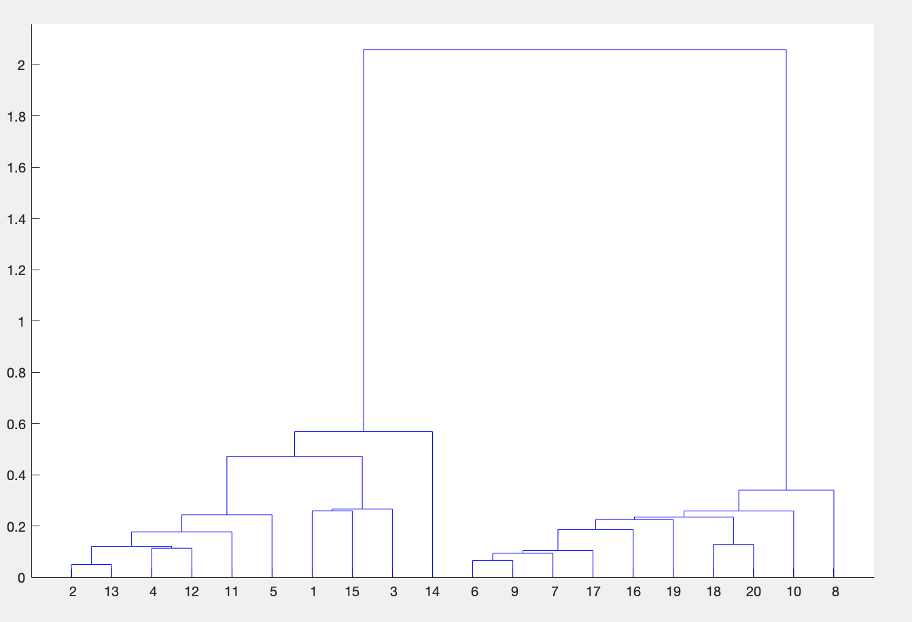

## Intro to Matlab & Hierarchical Clustering

Here we take random data and use Matlab to discover more information about the data.

Unlabeled Data

| x | y |
| --- | --- |
|0.29668 | 0.26248|
|0.31878 | 0.80101|
|0.42417 | 0.02922|
|0.50786 | 0.92885|
|0.085516 | 0.73033|
|2.4886 | 2.5468|
|2.5785 | 2.5211|
|2.2373 | 2.2316|
|2.4588 | 2.4889|
|2.9631 | 2.6241|
|0.67914 | 0.88517|
|0.39552 | 0.91329|
|0.36744 | 0.79618|
|0.98798 | 0.098712|
|0.037739| 0.26187|
|2.3354 | 2.6538|
|2.6797 | 2.4942|
|2.1366|2.7791
|2.7212 |2.715|
|2.1068|2.9037|

Data graphed on scatter plot

Data using Hierarchical Cluster in Matlab

